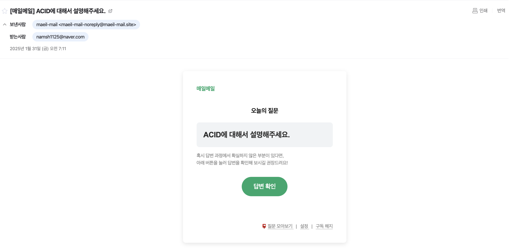
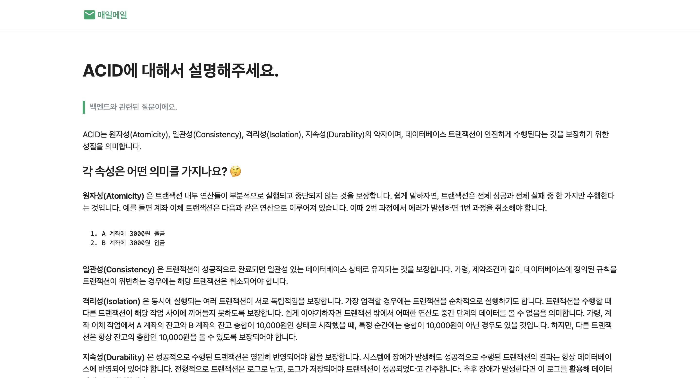

# ✨ HaruHana - 나만의 학습 설정 프로젝트 ✨

## 💡 기획 의도

혹시 [매일 메일](https://www.maeil-mail.kr/) 서비스에 대해 들어보신 적 있으신가요?

[매일 메일](https://www.maeil-mail.kr/) 서비스는 매일 아침마다 기술 면접 질문을 이메일로 받아보고 답변을 확인하며 면접 준비를 할 수 있는 서비스에요.

저희는 이 서비스에서 영감을 받아, 개발자를 꿈꾸는 사람들이 매일 꾸준히 실력을 쌓을 수 있는 플랫폼을 만들고자 했어요.

## 📌 프로젝트 소개

HaruHana는 개발자를 위한 맞춤형 학습 플랫폼이에요.

매일 아침, 사용자가 설정한 카테고리에 맞춰 새로운 문제가 제공되어, 다양한 개발 지식을 체계적으로 학습할 수 있도록 도와줘요.

## 🎨 디자인 시스템

### 컬러 팔레트 (Core Colors)

| 색상 이름  | 라이트 모드 | 다크 모드 | 용도                 |
| ---------- | ----------- | --------- | -------------------- |
| Primary    | `#4B49AC`   | `#818CF8` | 주요 버튼, CTA       |
| Secondary  | `#7978E9`   | `#A5B4FC` | 보조 버튼, 성공 상태 |
| Accent     | `#F3797E`   | `#FDA4AF` | 강조, 오류, 경고     |
| Background | `#F7F7FC`   | `#0F172A` | 배경                 |
| Text       | `#2D2B55`   | `#F8FAFC` | 텍스트               |

(해당 색상은 추후 변경될 수 있어요.)
